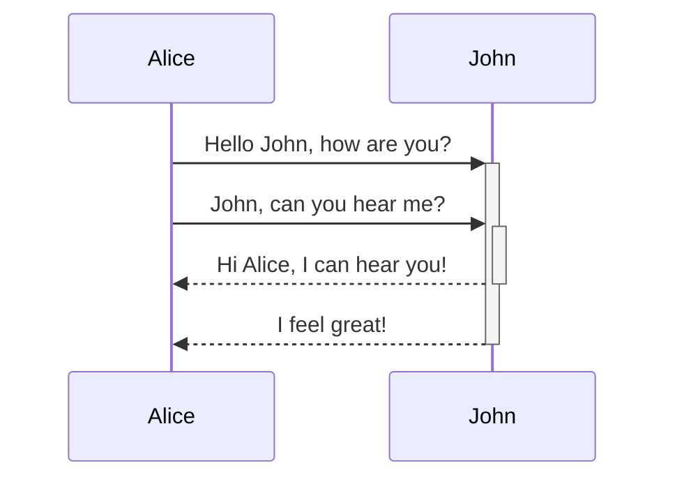

# This is a heading 1
## This is a heading 2
### This is a heading 3
#### This is a heading 4
##### This is a heading 5
###### This is a heading 6

***
page break ^

## syntax

> [example link leading to basic markdown syntax page](https://help.obsidian.md/syntax) <- external link 
> [[docs/plugins/index|index]] <- internal link
> *italics*
> **bold**
> ***bolditalic***
> ~~strikethrough~~
> ==highlight==

## lists

- First list item
- Second list item
- Third list item

1. First list item
2. Second list item
3. Third list item

- [x] This is a completed task.
- [ ] This is an incomplete task.

## callouts

>[!info]- info collapsible example
>text goes here

> [!question] Can callouts be nested?
> > [!todo] Yes!, they can.
> > > [!example]  You can even use multiple layers of nesting.

> [!abstract]
> Lorem ipsum dolor sit amet

> [!todo]
> Lorem ipsum dolor sit amet

> [!note]
> Lorem ipsum dolor sit amet

> [!info]
> Lorem ipsum dolor sit amet

> [!tip]
> Lorem ipsum dolor sit amet

> [!question]
> Lorem ipsum dolor sit amet

> [!success]
> Lorem ipsum dolor sit amet

> [!warning]
> Lorem ipsum dolor sit amet

> [!failure]
> Lorem ipsum dolor sit amet

> [!danger]
> Lorem ipsum dolor sit amet

> [!bug]
> Lorem ipsum dolor sit amet

> [!example]
> Lorem ipsum dolor sit amet

> [!quote]
> Lorem ipsum dolor sit amet

## footnotes and comments

This is a simple footnote[^1].

[^1]: This is the referenced text.
[^2]: Add 2 spaces at the start of each new line.
  This lets you write footnotes that span multiple lines.
[^note]: Named footnotes still appear as numbers, but can make it easier to identify and link references.

This is an %%inline%% comment.

%%
This is a block comment.

Block comments can span multiple lines.
%%

## tables

| first | second | third |
| ----- | ------ | ----- |
|       |        |       |
|       |        |       |

## diagrams and mathematics 

see [mermaid](https://mermaid.js.org/#/) for a better explanation and more examples of syntax

see [mathjax](https://math.meta.stackexchange.com/questions/5020/mathjax-basic-tutorial-and-quick-reference) for more examples and explanations of syntax

$$
\begin{vmatrix}a & b\\
c & d
\end{vmatrix}=ad-bc
$$

